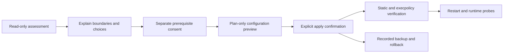

# How it works

## Installation flow

The skill executes a staged workflow so that assessment, consent, mutation, and verification cannot be confused:



### 1. Assess

`Assess-CodexSafety.ps1` reads configuration, relevant path existence, and tool versions. It does not read secret contents. Its report separates the approval reviewer, filesystem policy, command-network policy, Windows sandbox implementation, prerequisite status, legacy conflicts, and external surfaces.

### 2. Select a profile

All three approval modes use the same least-privilege filesystem profile:

- `BoundedAutonomy`: `approval_policy = "never"`; out-of-bound actions fail.
- `AskMe`: eligible requests use `on-request` with the user as reviewer.
- `AutoReview`: eligible requests use `on-request` with an agent reviewer.

Command networking is configured separately as off, proxy-enforced allowlist, or explicitly acknowledged unrestricted access.

### 3. Preview and apply

`Install-CodexSafety.ps1 -PlanOnly` shows the exact managed targets and decisions without changing them. Applying requires `-ConfirmApply -NonInteractive`. High-risk or administrator-backed choices require additional acknowledgements. Legacy sandbox migration is rejected unless `-MigrateLegacySettings` is present.

The installer preserves unrelated TOML content, backs up each managed target, writes the permission profile and rule, registers authorized workspace roots, installs a synthetic outside-workspace canary, and records rollback state.

### 4. Verify

`Test-CodexSafety.ps1` checks the generated configuration and, when a compatible CLI is available, calls `codex execpolicy check` against both allowed and deliberately broad command prefixes. Missing CLI verification produces `PARTIAL`, never a false `PASS`.

### 5. Roll back

`Rollback-CodexSafety.ps1` first displays the recorded target backup. Restore or removal happens only after confirmation. The rollback implementation validates every target against its fixed Codex Home layout before writing.

## Checkpoint bridge

The workspace sandbox intentionally protects `.git`. The optional bridge is copied to `CODEX_HOME/safe-setup/bin` and is the only PowerShell script allowed by the generated command rule. The rule matches the exact PowerShell 7 executable and exact bridge path; it does not allow a general `pwsh`, `powershell`, `git`, shell wrapper, or arbitrary script.

For `Save`, the bridge:

1. Resolves the requested repository to a canonical path.
2. Confirms it is present in `authorized-workspaces.json`.
3. Confirms the configured Git executable still has its pinned SHA-256.
4. Refuses sensitive-looking untracked paths.
5. Uses a temporary Git index to build a tree and commit.
6. Stores the commit under `refs/codex-safe/checkpoints/*`.
7. Removes the temporary index.

The current branch, `HEAD`, real index, and working tree are unchanged. The bridge exposes only `Save` and `List`. Recovery stays user-controlled and should normally use a separate worktree:

```powershell
git worktree add <new-empty-directory> <checkpoint-commit>
```

## Files managed on the user machine

Exact locations depend on `CODEX_HOME`, which defaults to the normal Codex user directory.

| Target | Purpose |
|---|---|
| `config.toml` | Active permission, approval, sandbox, and network selections |
| `rules/codex-safe-setup.rules` | Exact checkpoint command rule |
| `safe-setup/bin/New-CodexCheckpoint.ps1` | Installed narrow checkpoint bridge |
| `safe-setup/authorized-workspaces.json` | Canonical workspace roots and pinned Git |
| `safe-setup/backups/*` | Restore material and installation state |
| `safe-setup/outside-workspace-canary.txt` | Synthetic target for boundary testing |

## Source layout

- `.codex-plugin/plugin.json`: plugin identity and install metadata.
- `.agents/plugins/marketplace.json`: Git-backed marketplace entry.
- `skills/secure-codex-setup/SKILL.md`: agent workflow and mandatory safety contract.
- `skills/secure-codex-setup/scripts/`: deterministic assessment, install, verify, checkpoint, and rollback code.
- `skills/secure-codex-setup/references/`: detailed profile, security, and recovery guidance loaded when needed.
- `tests/`: isolated integration and package checks.
- `tools/Build-Release.ps1`: install-ready ZIP builder.

## ZCode edition: the OS cage (Windows)

The ZCode edition keeps the same staged contract (assess -> explain -> separate consents
-> plan-only preview -> apply with self-cleanup -> verify -> exact rollback) but moves
the enforcement from the Codex engine to the operating system, because ZCode has no
configuration-file permission surface.

What gets written on the user machine:

| Target | Content |
|---|---|
| local user (default `ZCode-Sandbox`) | standard account, random 32-char password, stored DPAPI(CurrentUser)-encrypted under the cage state; only the main user can decrypt |
| `C:\Program Files\ZCodeSandbox\` | robocopy of the ZCode install + RX ACE for the sandbox user (admin-controlled path, required on hardened machines) |
| authorized workspace roots | Modify ACEs for the sandbox user, recorded in install-state.json |
| secret-like files in those roots | deny ACE (`:R`) for the sandbox user, enumerated at install time |
| `~/.zcode/safe-setup/` | install-state.json, authorized-workspaces.json, bin\ launcher + checkpoint bridge, canary, probe scratch |
| Start Menu | "ZCode (Sandboxed)" shortcut launching the cage |

Rollback is driven exclusively by install-state.json: ACEs removed, install copy
deleted, shortcut removed, sandbox account and profile deleted; workspace trees are
never touched. The cage state itself lives in the main user's profile and is therefore
unreachable for the sandbox user - the boundary protects its own configuration.

Launcher mechanics worth knowing (verified on the reference machine):
`Start-Process -Credential` cannot be combined with `-Wait` or `-WindowStyle Hidden`
(both throw although the launch succeeds), so the launcher and probes synchronize via
result files. See [zcode-probe/PROBE-REPORT.md](zcode-probe/PROBE-REPORT.md).
