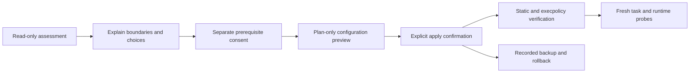

# How it works

## Installation flow

The skill executes a staged workflow so that assessment, consent, mutation, and verification cannot be confused:



### 1. Assess

`Assess-CodexSafety.ps1` reads configuration, relevant path existence, and tool versions. It does not read secret contents. Its report separates the approval reviewer, filesystem policy, command-network policy, Windows sandbox implementation, prerequisite status, legacy conflicts, and external surfaces.

### 2. Select a routing mode

Version 0.2.0 separates permission routing from approval policy:

- `DynamicUi` exposes two positive-only named profiles on Codex 0.138.0 or newer and uses built-in `:workspace` only as the startup default. It has no sticky filesystem deny entries, and the user's last deliberate click governs the next message.
- `StrictProfile` uses `default_permissions = "codex-safe-workspace"` with root deny-read, credential deny-globs, and optional proxy allowlists. It is the stronger read boundary but is not the pure dynamic Full Access route.

All three approval modes work with either route:

- `BoundedAutonomy`: `approval_policy = "never"`; out-of-bound actions fail.
- `AskMe`: eligible requests use `on-request` with the user as reviewer.
- `AutoReview`: eligible requests use `on-request` with an agent reviewer.

Command networking is configured separately as offline with no proxy, proxy-enforced allowlist, or explicitly acknowledged direct unrestricted access with no proxy. DynamicUi supports Off and Unrestricted; it rejects Allowlist because a persistent proxy would keep constraining Full Access. StrictProfile supports all three modes.

Both DynamicUi Custom profiles extend Codex's Workspace sandbox and contain no explicit filesystem deny. Reads follow that sandbox's broader scope; workspace credential files remain readable while the workspace is writable. Applying DynamicUi requires an explicit read-scope acknowledgement.

### 3. Preview and apply

`Install-CodexSafety.ps1 -PlanOnly` shows the exact managed targets and decisions without changing them. Applying requires `-ConfirmApply -NonInteractive`. High-risk or administrator-backed choices require additional acknowledgements. Legacy sandbox migration is rejected unless `-MigrateLegacySettings` is present.

The installer preserves unrelated TOML content, backs up each managed target, writes the selected permission route and rule, registers authorized workspace roots, installs a synthetic outside-workspace canary, and records rollback state.

Since 0.3.0 the installer edits TOML structurally. Plugin-owned top-level settings live in a `codex-safe-setup top-level` block placed strictly before the first `[table]`, and the named profiles live in a `codex-safe-setup profiles` block at the end of the file; both regions carry generated markers and are regenerated wholesale on every install or upgrade. Before any write, the candidate must pass structural validation (misplaced top-level keys, duplicate tables or top-level keys, unterminated multi-line values, and managed-block ordering all fail closed). Keys that belong to other writers but sit under a wrong `[table]` are reported by name, section, and line; `-RepairForeignMisplacedKeys` relocates them to the top level only when no same-named key already exists there, so the plugin never silently picks between two user-owned values. Every configuration write re-verifies the file's SHA-256 against the plan-time snapshot (`CONCURRENT_MODIFICATION` abort) and confirms the written bytes afterwards, restoring exact prior content if verification fails.

A machine-configuration change needs one fresh task. After that activation, DynamicUi changes are different: select Custom, Full Access, Workspace, or Read-only and send the next user message; the same task must adopt the corresponding policy without restarting Codex. If administrator prompts repeat on Windows, close every Codex desktop and CLI process before one clean relaunch.

The Windows sandbox stores firewall setup for the active network route. `Allowlist` expects loopback proxy ports 3128 and 8081; `Off` and direct `Unrestricted` expect no proxy ports. If an older task and a newly configured task use different port sets, each can invalidate the other's global setup and cause another administrator prompt. The read-only assessment retains only matching firewall port-change records from Codex's sandbox log and reports `WindowsSandboxSetupHealth`; it never includes logged command lines. A `CONFLICT` means the latest setup does not match the selected mode. `OSCILLATION_HISTORY` means a direct reversal occurred but the latest setup is aligned, so verification passes and no action is required unless prompts recur.

### 4. Upgrade an existing installation

`Upgrade-CodexSafety.ps1` reads the active install state and preserves its recorded selections by default. Running it without `-ConfirmUpgrade` is plan-only. A confirmed upgrade creates a unique transaction directory under `safe-setup/backups`, snapshots the previous active state under `safe-setup/state-history`, and then invokes the same deterministic installer in explicit upgrade mode.

Version 0.1.5 removed the alternate Status/Commit Git backend and rewrote old workspace registries to Save/List-only recovery. Version 0.1.6 migrated schema 4 to schema 5. The 0.1.7-0.1.9 development cycle tested several DynamicUi representations. Version 0.2.0 migrated to schema 9 and kept the verified positive-only runtime route. Version 0.3.0 keeps schema 9 and replaces the retired Desktop compatibility layer reference with structural TOML ownership: legacy single managed blocks migrate automatically on the next install or upgrade. Plugin refresh, machine configuration, and already-running task remain separate layers.

### 5. Verify

`Test-CodexSafety.ps1` checks the generated configuration and, when a compatible CLI is available, calls `codex execpolicy check` against both allowed and deliberately broad command prefixes. Missing CLI verification produces `PARTIAL`, never a false `PASS`.

Runtime checks are route-specific and use a fresh task after machine-configuration changes. DynamicUi's Desktop verifier runs `codex-safe-workspace` → Full Access → built-in Workspace in one task. Runtime PASS correlates every probe with effective `turn_context`, actual unified-exec result, later `task_complete`, and an outside-workspace canary. UI PASS is separate and requires direct observation that the deliberately clicked label does not change before send, during execution, or after completion; rollout metadata cannot prove that visual condition. StrictProfile verification uses the effective managed policy. The codexsandboxonline/offline account name is never permission evidence.

When only the Windows Desktop label misbehaves, treat it as an upstream Desktop defect. Version 0.2.0 briefly shipped a compatibility layer that launched the signed client with a process-scoped loader and session preload pinned to an undocumented feature gate; version 0.2.1 removed that layer entirely and replaced it with `Remove-LegacyDesktopSelectorArtifacts.ps1`, which deletes only exact retired shortcuts, environment variables, and state folders after archiving them. The project observes, documents, and reports Desktop display defects upstream instead of modifying launch behavior or client internals.

### 6. Roll back

`Rollback-CodexSafety.ps1` first displays the recorded target backup. Restore or removal happens only after confirmation. The rollback implementation validates every target against its fixed Codex Home layout before writing. After an upgrade it also restores the previous active-state snapshot, so another rollback can continue to the preceding generation.

## Checkpoint bridge

The workspace sandbox intentionally protects `.git`. The optional bridge is copied to `CODEX_HOME/safe-setup/bin` and is the only PowerShell script allowed by the generated command rule. The rule matches the exact PowerShell 7 executable and exact bridge path; it does not allow a general `pwsh`, `powershell`, `git`, shell wrapper, or arbitrary script.

Every action resolves a canonical worktree root, checks authorized-workspaces.json, and verifies the pinned Git executable hash.

- Save refuses sensitive-looking untracked paths, builds a temporary index, and stores a hidden checkpoint under refs/codex-safe/checkpoints/*. The current branch, real index, and working tree remain unchanged.
- List enumerates checkpoint refs.
- Status and Commit are intentionally unavailable. Normal Git operations remain native Git and require a task whose effective permissions allow repository-metadata writes.

The bridge is not a general Git escape. Recovery from `Save` remains user-controlled and should normally use a separate worktree:

```powershell
git worktree add <new-empty-directory> <checkpoint-commit>
```

## Files managed on the user machine

Exact locations depend on `CODEX_HOME`, which defaults to the normal Codex user directory.

| Target | Purpose |
|---|---|
| `config.toml` — `codex-safe-setup top-level` block | Plugin-owned top-level settings (`default_permissions`, StrictProfile approval keys), placed before the first `[table]` |
| `config.toml` — `codex-safe-setup profiles` block | Named permission profiles owned by the plugin, appended at the end of the file |
| `rules/codex-safe-setup.rules` | Exact Save/List recovery bridge rule |
| `safe-setup/bin/New-CodexCheckpoint.ps1` | Installed narrow recovery bridge |
| `safe-setup/authorized-workspaces.json` | Canonical roots and pinned Git for recovery checkpoints |
| `safe-setup/backups/<transaction>/*` | Restore material isolated by install or upgrade transaction |
| `safe-setup/state-history/*` | Immutable prior-state snapshots and rolled-back state records |
| `safe-setup/outside-workspace-canary.txt` | Synthetic target for boundary testing |
| `safe-setup/legacy-selector-quarantine-<timestamp>/` | Archived shortcuts and retired state moved out by the legacy selector cleanup |

## Source layout

- `.codex-plugin/plugin.json`: plugin identity and install metadata.
- `.agents/plugins/marketplace.json`: Git-backed marketplace entry.
- `skills/codex-safe-setup/SKILL.md`: agent workflow and mandatory safety contract.
- `skills/codex-safe-setup/scripts/`: deterministic assessment, install, verify, checkpoint, and rollback code.
- `skills/codex-safe-setup/references/`: detailed profile, security, and recovery guidance loaded when needed.
- `tests/`: isolated integration and package checks.
- `tools/Build-Release.ps1`: install-ready ZIP builder.
