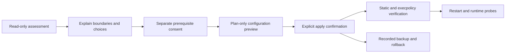

# How it works

## Installation flow

The skill executes a staged workflow so that assessment, consent, mutation, and verification cannot be confused:



### 1. Assess

`Assess-CodexSafety.ps1` reads configuration, relevant path existence, and tool versions. It does not read secret contents. Its report separates the approval reviewer, filesystem policy, command-network policy, Windows sandbox implementation, prerequisite status, legacy conflicts, and external surfaces.

### 2. Select a profile

All three approval modes use the same least-privilege filesystem profile:

- `BoundedAutonomy`: `approval_policy = "never"`; out-of-bound actions fail.
- `AskMe`: eligible requests use `on-request` with the user as reviewer.
- `AutoReview`: eligible requests use `on-request` with an agent reviewer.

Command networking is configured separately as offline with no proxy, proxy-enforced allowlist, or explicitly acknowledged direct unrestricted access with no proxy. The last mode is what enables proxy-unaware native protocols such as OpenSSH.

default_permissions selects only the fallback profile. An explicit task-level UI selection must take precedence; Full Access is accepted only when the returned activePermissionProfile is :danger-full-access (or equivalent authoritative task metadata).

### 3. Preview and apply

`Install-CodexSafety.ps1 -PlanOnly` shows the exact managed targets and decisions without changing them. Applying requires `-ConfirmApply -NonInteractive`. High-risk or administrator-backed choices require additional acknowledgements. Legacy sandbox migration is rejected unless `-MigrateLegacySettings` is present.

The installer preserves unrelated TOML content, backs up each managed target, writes the permission profile and rule, registers authorized workspace roots, installs a synthetic outside-workspace canary, and records rollback state.

On Windows, writing the configuration is not the activation boundary. Restart Codex and use a new task because an existing execution environment retains its original sandbox and proxy state. If administrator prompts repeat, close every Codex desktop and CLI process before one clean relaunch. The preferred `Elevated` sandbox may request administrator-approved OS setup, but it does not elevate each workspace command.

The Windows sandbox stores firewall setup for the active network route. `Allowlist` expects loopback proxy ports 3128 and 8081; `Off` and direct `Unrestricted` expect no proxy ports. If an older task and a newly configured task use different port sets, each can invalidate the other's global setup and cause another administrator prompt. The read-only assessment retains only matching firewall port-change records from Codex's sandbox log and reports `WindowsSandboxSetupHealth`; it never includes logged command lines. A `CONFLICT` means the latest setup does not match the selected mode. `OSCILLATION_HISTORY` means a direct reversal occurred but the latest setup is aligned, so verification passes and no action is required unless prompts recur.

### 4. Upgrade an existing installation

`Upgrade-CodexSafety.ps1` reads the active install state and preserves its recorded selections by default. Running it without `-ConfirmUpgrade` is plan-only. A confirmed upgrade creates a unique transaction directory under `safe-setup/backups`, snapshots the previous active state under `safe-setup/state-history`, and then invokes the same deterministic installer in explicit upgrade mode.

Version 0.1.5 also removes the alternate Status/Commit Git backend and rewrites old workspace registries to the Save/List-only recovery schema. The plugin bundle, applied machine configuration, install-state history, and already-running task are separate layers. Refreshing or reinstalling the plugin changes only the first layer. The configuration upgrade changes the second and third layers after review. A full restart and fresh task activate the fourth.

### 5. Verify

`Test-CodexSafety.ps1` checks the generated configuration and, when a compatible CLI is available, calls `codex execpolicy check` against both allowed and deliberately broad command prefixes. Missing CLI verification produces `PARTIAL`, never a false `PASS`.

Runtime checks are route-specific and require a new task after machine-configuration changes: Off proves a reachable endpoint is blocked; Allowlist proves an allowed domain succeeds through the proxy while an unlisted domain fails; Unrestricted proves native direct TCP or OpenSSH works without treating a proxy-only banner as sufficient. Task permission checks are separate: Full Access must report activePermissionProfile.id = :danger-full-access, and the codexsandboxonline/offline account name is not evidence.

### 6. Roll back

`Rollback-CodexSafety.ps1` first displays the recorded target backup. Restore or removal happens only after confirmation. The rollback implementation validates every target against its fixed Codex Home layout before writing. After an upgrade it also restores the previous active-state snapshot, so another rollback can continue to the preceding generation.

## Checkpoint bridge

The workspace sandbox intentionally protects `.git`. The optional bridge is copied to `CODEX_HOME/safe-setup/bin` and is the only PowerShell script allowed by the generated command rule. The rule matches the exact PowerShell 7 executable and exact bridge path; it does not allow a general `pwsh`, `powershell`, `git`, shell wrapper, or arbitrary script.

Every action resolves a canonical worktree root, checks authorized-workspaces.json, and verifies the pinned Git executable hash.

- Save refuses sensitive-looking untracked paths, builds a temporary index, and stores a hidden checkpoint under refs/codex-safe/checkpoints/*. The current branch, real index, and working tree remain unchanged.
- List enumerates checkpoint refs.
- Status and Commit are intentionally unavailable. Normal Git operations remain native Git and require a task whose effective permissions allow repository-metadata writes.

The bridge is not a general Git escape. Recovery from `Save` remains user-controlled and should normally use a separate worktree:

```powershell
git worktree add <new-empty-directory> <checkpoint-commit>
```

## Files managed on the user machine

Exact locations depend on `CODEX_HOME`, which defaults to the normal Codex user directory.

| Target | Purpose |
|---|---|
| `config.toml` | Active permission, approval, sandbox, and network selections |
| `rules/codex-safe-setup.rules` | Exact status/checkpoint/opt-in commit bridge rule |
| `safe-setup/bin/New-CodexCheckpoint.ps1` | Installed narrow checkpoint bridge |
| `safe-setup/authorized-workspaces.json` | Canonical roots, commit-enabled roots, allowed branch prefixes, and pinned Git |
| `safe-setup/backups/<transaction>/*` | Restore material isolated by install or upgrade transaction |
| `safe-setup/state-history/*` | Immutable prior-state snapshots and rolled-back state records |
| `safe-setup/outside-workspace-canary.txt` | Synthetic target for boundary testing |

## Source layout

- `.codex-plugin/plugin.json`: plugin identity and install metadata.
- `.agents/plugins/marketplace.json`: Git-backed marketplace entry.
- `skills/codex-safe-setup/SKILL.md`: agent workflow and mandatory safety contract.
- `skills/codex-safe-setup/scripts/`: deterministic assessment, install, verify, checkpoint, and rollback code.
- `skills/codex-safe-setup/references/`: detailed profile, security, and recovery guidance loaded when needed.
- `tests/`: isolated integration and package checks.
- `tools/Build-Release.ps1`: install-ready ZIP builder.
